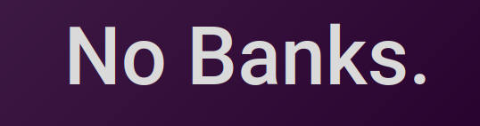

<h1 align="center">🏦 NoBanks.</h1>

<p align="center">
    
</p>

**Conteúdo da Disciplina**: Algoritmos Ambiciosos<br>

## Alunos

| Matrícula |                        Aluno                        |
| :-------: | :-------------------------------------------------: |
| 190025581 | [Bruno Oliveira Lima](https://github.com/eng-Bruno) |
| xx/xxxxxx |                   xxxx xxxx xxxxx                   |

## 📄 Sobre 
O NoBanks é um software que funciona como uma simulação de um caixa eletrônico, onde sua principal funcionalidade está no saque. O NoBanks realiza um saque desejado pelo cliente e utiliza o algoritmo para retornar a menor quantidade possível de cédulas.

## 📷 Screenshots


## ⚙️ Instalação 
**Linguagem**: JavaScript<br>
**Framework**: React<br>

## 💻 Pré-requisitos

`<Node/ v16 lts> <NPM/ v7.10.0>`  ou superior.

## 💻 Uso 
Após clonar o repositório, utilize os seguintes comandos:
<br>

```cd no-banks```

<br>

```npm install``` 

<br>

```npm start```

## Apresentação

[No Banks. - Greed](./apresentação/apresentacao_NoBanks.zip) - presente no repositório


